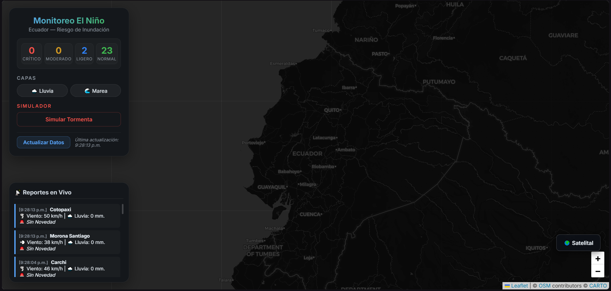
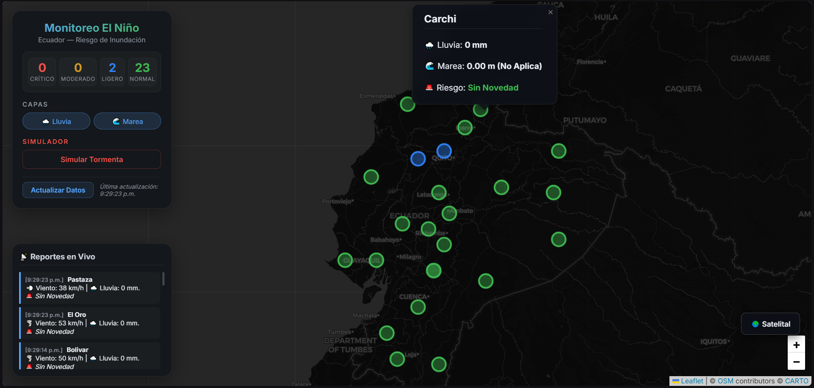
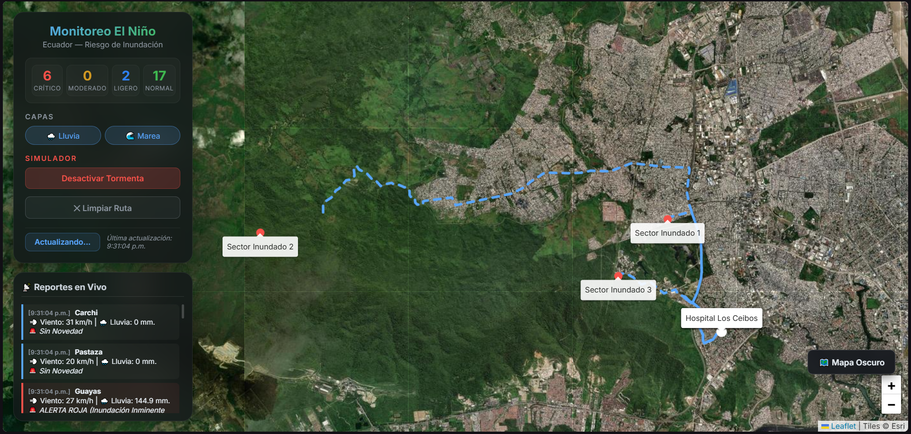

# 🌍 Plataforma de Monitoreo Geoespacial y Alerta Temprana - Fenómeno de El Niño


> **📄 Informe Técnico Oficial:** Puedes consultar la investigación completa, el diseño de infraestructura y todas las justificaciones académicas en el documento PDF adjunto: [**Proyecto Final.pdf**](docs/Proyecto%20final.pdf)

## 📖 Descripción General
Este proyecto implementa una arquitectura **Event-Driven de Big Data** diseñada para ingerir, procesar, almacenar y visualizar datos climáticos en tiempo cuasi-real. Su objetivo es monitorear el impacto del Fenómeno de El Niño en Ecuador, cruzando datos de precipitación (Open-Meteo) y mareas (INOCAR simulado) para generar **rutas de evacuación inteligentes** utilizando OSRM ante riesgos de inundación por represamiento en provincias vulnerables.

---

## 🚀 Tecnologías Utilizadas

### Pipeline de Datos (Backend)
* **Apache Kafka**: Bus de mensajería distribuida para ingesta de datos en tiempo real (Productor Java).
* **Apache Spark (Structured Streaming)**: Motor de micro-lotes para limpieza de datos, *windowing* temporal y cálculo de índices de riesgo cruzado.
* **HDFS (Hadoop Distributed File System)**: Data Lake para el almacenamiento de datos analíticos estructurados particionados por provincia.
* **Apache Parquet**: Formato de almacenamiento columnar altamente comprimido y optimizado para consultas analíticas rápidas.
* **Java 17**: Lenguaje principal de los productores y procesadores de streaming.

### Servicio y Presentación (Frontend)
* **Python (FastAPI)**: Microservicio REST ultraligero que extrae los datos particionados de HDFS (`pandas` + `pyarrow`) y los expone al cliente.
* **Leaflet & OpenStreetMap (CARTO Dark / ESRI Satellite)**: Renderizado cartográfico.
* **OSRM (Open Source Routing Machine)**: Algoritmo de ruteo de red vial para calcular vías de evacuación (distancia euclidiana a zonas seguras).
* **Vanilla JS + HTML5 + CSS3**: Interfaz de usuario con diseño *Glassmorphism*, sistema de capas unificadas y feed de reportes en vivo.

---

## 📁 Estructura del Proyecto

```text
📦 Proyecto
 ┣ 📂 dashboard_api          # Capa de Servicio y Presentación
 ┃ ┣ 📂 static               # Frontend web
 ┃ ┃ ┣ 📜 app.js             # Lógica del cliente, ruteo OSRM y Live Feed
 ┃ ┃ ┣ 📜 index.html         # Interfaz principal (Dashboard)
 ┃ ┃ ┗ 📜 styles.css         # Estilos (Glassmorphism, variables CSS)
 ┃ ┣ 📜 main.py              # Backend FastAPI para lectura de HDFS
 ┃ ┗ 📜 requirements.txt     # Dependencias de Python
 ┣ 📂 src                    # Capa de Ingesta y Procesamiento Distribuido
 ┃ ┗ 📂 main
 ┃   ┗ 📂 java/org/example
 ┃     ┣ 📜 ClimaStreamingProcessor.java  # Motor Spark Structured Streaming (Riesgo)
 ┃     ┣ 📜 MareaProducer.java            # Productor Kafka (Simulador INOCAR)
 ┃     ┗ 📜 MeteorologiaProducer.java     # Productor Kafka (API Open-Meteo)
 ┣ 📂 docs                   # Documentación y capturas
 ┃ ┗ 📂 images               # Ubicación de screenshots del proyecto
 ┣ 📜 pom.xml                # Configuración Maven y dependencias Java
 ┗ 📜 README.md              # Documentación del proyecto
```

---

## ⚙️ Requisitos Previos
1. **Java Development Kit (JDK) 17** configurado en el `PATH`.
2. **Apache Kafka** y **ZooKeeper** instalados localmente.
3. **Hadoop** (HDFS) pre-configurado y ejecutándose en el puerto 9000 (NameNode) y 9870 (Web UI). Se requiere binario `winutils.exe` en Windows.
4. **Python 3.10+** (pip).
5. **Maven** para la gestión de dependencias Java.

---

## 🛠️ Instalación y Configuración

### 1. Iniciar la Infraestructura Base (Zookeeper, Kafka, HDFS)
Abre 3 terminales separadas en tu entorno (WSL, Git Bash o CMD) e inicia los servicios:
```bash
# Terminal 1: ZooKeeper
./bin/zookeeper-server-start.sh ./config/zookeeper.properties

# Terminal 2: Kafka Broker
./bin/kafka-server-start.sh ./config/server.properties

# Terminal 3: HDFS (Si usas scripts de Hadoop)
start-dfs.sh
```

Asegúrate de tener creados los tópicos de Kafka:
```bash
./bin/kafka-topics.sh --create --topic precip-gpm --bootstrap-server localhost:9092
./bin/kafka-topics.sh --create --topic mareas-inocar --bootstrap-server localhost:9092
```

### 2. Ejecutar Ingesta y Procesamiento
Puedes compilar y ejecutar los productores/consumidores desde tu IDE (VS Code / IntelliJ) o mediante Maven:
1. Inicia **`MeteorologiaProducer.java`** (Extrae lluvia real de Ecuador vía Open-Meteo cada 60s).
2. Inicia **`MareaProducer.java`** (Genera modelos algorítmicos de marea costera).
3. Inicia **`ClimaStreamingProcessor.java`** (Spark consume los mensajes JSON, aplica *windowing*, cruza los riesgos y guarda en `/user/root/processed/riesgo_combinado` de HDFS en formato Parquet).

### 3. Ejecutar el API Backend (Python)
Desde la terminal, dentro de la carpeta `dashboard_api/`:
```bash
pip install -r requirements.txt
uvicorn main:app --reload --port 8000
```

### 4. Visualizar el Dashboard
Abre tu navegador y entra a:
`http://localhost:8000/`

---

## 📸 Vistas de la Aplicación

### 1. Vista General y Live Feed
Muestra el estado cartográfico de las 24 provincias, el panel *Glassmorphism* con las estadísticas generales y el "Chat" de reportes técnicos a la izquierda.


### 2. Lógica de Capas (Riesgo Combinado)
Muestra el efecto de activar los botones "Lluvia" y "Marea" simultáneamente para visualizar exclusivamente las provincias costeras en ALERTA ROJA por riesgo de represamiento, con la UI en Modo Oscuro (CARTO).


### 3. Simulador de Tormenta y Rutas de Evacuación (OSRM)
Muestra la respuesta del sistema al inyectar anomalías pluviométricas. Se debe observar el trazado dinámico de múltiples líneas azules de evacuación conectando puntos vulnerables con zonas altas calculadas por distancia Euclidiana, junto con la Capa Satelital (ESRI) activada.


---
*Desarrollado para la materia de Intercambio de Datos en Entornos Distribuidos y Visualización de Datos.*
